# 5.1 Computing Clusters
上周，我们讨论了单台计算机内部的并行性问题。多个内核，内核中的向量指令以及内存子系统的并行性。本周，我们将讨论分布式内存编程中的计算集群。当您的应用程序达到单台计算机的扩展限制时，您可能希望在多台计算机上运行它。如果它们连接到公共网络，它们可以形成计算集群。通常，您会看到多个机柜充满连接到网络中的计算节点。根据集群的用途，网络的范围可以从通用千兆位以太网到专用互连，如InfiniBand或Intel Omni-Path。如果您教它如何做，那么您的程序将只在群集的多个计算节点上并行工作。就像你必须教你的程序在计算节点内部使用多个核心一样，以及如何教它使用向量指令而不是核心。

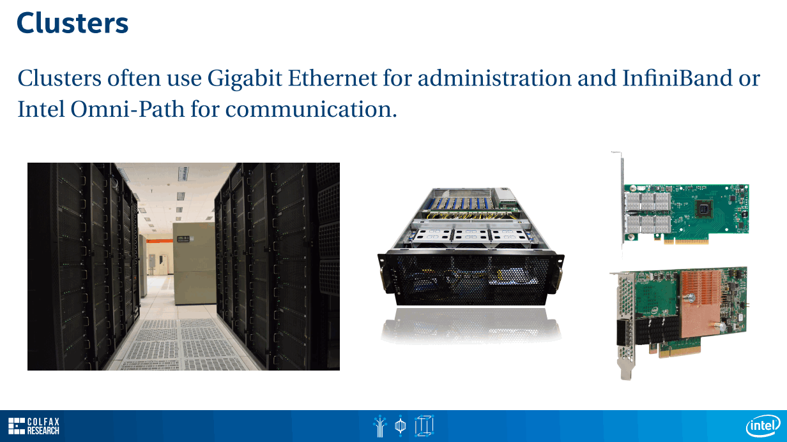

对于集群，您正在处理分布式内存系统。这意味着，当进程在计算节点上运行时，它不能直接在其他计算节点上读取或写入内存，至少不是以透明的方式。您必须通过网络物理传输数据。因此，您必须使用某种消息传递来协调集群中多个计算节点之间的工作。基于UDP等低级网络协议进行此消息传递通常是不切实际的。我们将研究计算应用程序中消息传递的专用框架。该框架称为MPI，消息传递接口。

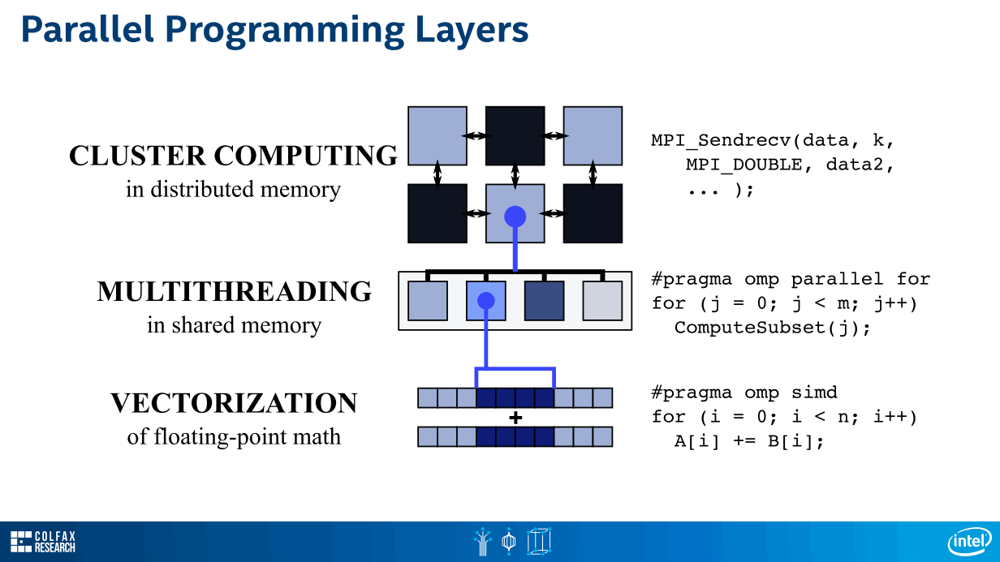

# 5.2 Message Passing Interface
为什么MPI是分布式内存计算的良好框架？MPI代表消息传递接口，MPI本身是消息传递的规范。因此，您可以下载一个大型PDF文档，描述MPI应支持的功能和数据类型。因此，作为程序员，您可以实现消息传递应用程序。并且有多种MPI实现。我们将用于本课程，英特尔MPI。MPI的实现，尝试便携和高效。如你所知，这两个目标往往相互冲突。可移植的方法，在多种体系结构上运行，但是有效的方法，以强制执行特定的体系结构。对于不同的处理器和通信结构体系结构，MPI实现可以自由地放入不同的库中。所以，作为程序员，你不会感到任何改变。您保留相同的代码，因此您可以移植。但与此同时，在幕后，您正在为特定架构使用高效的库。MPI专为计算而设计，您可以在它支持的通信原语中看到它。它支持允许您实现计算应用程序中常见通信模式的功能。MPI的主要目的是分布式内存计算。因此，您将多台计算机连接到网络中，使用MPI在它们之间发送消息。但您也可以在共享内存中使用MPI，这意味着您拥有一台具有多个内核的计算机。您可以在共享内存系统中相互运行MPI进程消息传递，这样您就可以使用进程在线程之间进行扩展。我们在讨论OpenMP时讨论了线程和进程的权衡。

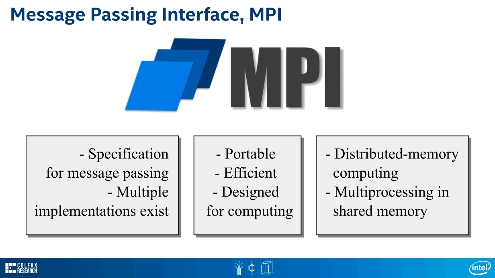

MPI和OpenMP相互补充。您可以使用MPI在群集中的计算节点之间进行扩展，然后您可以在MPI进程内使用OpenMP来扩展核心。它并不总是那样。在处理器只有几个内核（一，二，四）的日子里，只使用MPI就可以了。您可以在单个计算节点上将每个核心的MPI进程放一个，然后使用更多MPI进程继续填充集群上的核心。但是今天，这是不实际的，因为例如，使用Intel Xeon 5处理器，你有72个核心。每个核心都有四路超线程可能最多支持四个线程或四个进程。对于在各个逻辑处理器上运行的如此多的MPI进程而言，这太多了，您需要太多的通信开销和太多的内存开销。因此，现代应用通常使用混合方法。MPI可跨计算节点扩展，OpenMP可跨核心扩展。有时，每个计算节点只有几个MPI进程。例如，优雅地处理two way处理器中的NUMA系统。MPI的良好实现应该了解OpenMP，它们应该能够很好地运行它。MPI的一个很好的特性是，作为程序员，您通常不必担心处理器的通信方式。例如，这两个进程将在后台使用此计算节点的共享内存发送消息。但是这两个进程将使用网络互连进行通信。这在MPI中完全透明，作为程序员，您不必担心它。该实现替代了正确的消息传递结构。

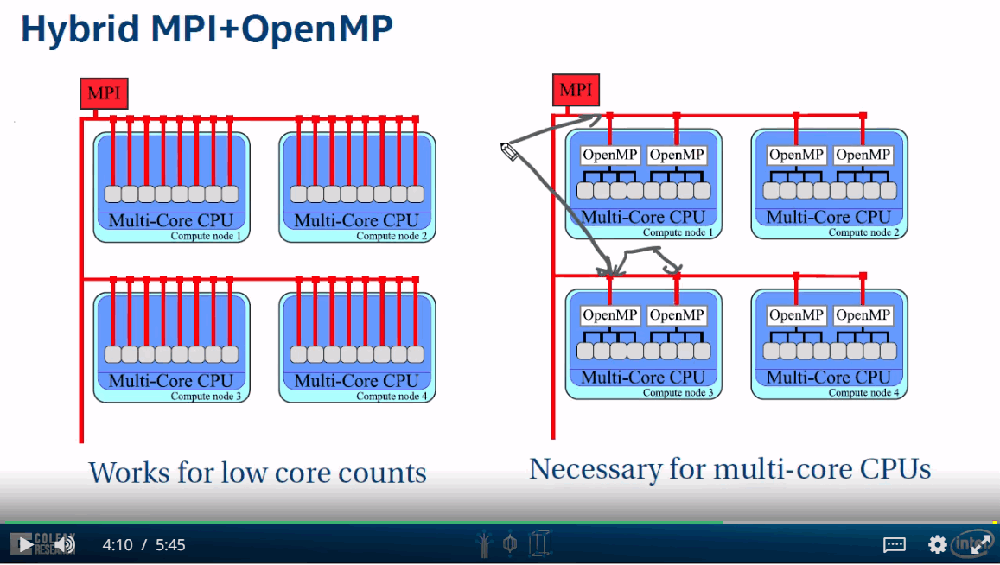

当您的群集使用专用通信结构（例如Intel Omni-Path Architecture）时，这尤其有用。这是一种可与英特尔至强5处理器和Xeon处理器本机配合使用的结构。Omni-Path是一种低延迟，高带宽，可扩展的通信结构，适用于高性能计算应用。它专为HPC设计。它有两种形式，分立和集成。在分立形式中，这是PCI Express添加卡。这是进入系统板的连接器。这是连接到系统的专用switch的连接器。或者，您可以在KNL-F形式中找到带有集成互连的Intel Xeon 5处理器。同样，这是进入系统板的芯片。这是连接到专用switch的连接器。没有PCI Express总线。在这两种情况下，您都在寻找一种通信结构，它允许您的消息以微秒延迟和每秒100千兆位的带宽传输。当您使用MPI时，您不需要了解有关使用Omni-Path编程的任何特殊信息，只需使用消息传递规范即可。MPI实现应该负责整个专用结构的通信。

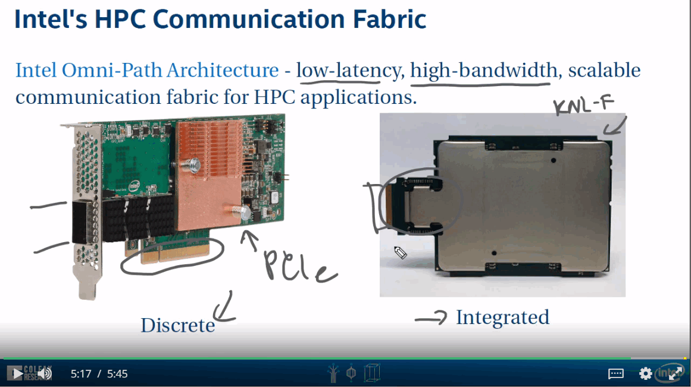

# 5.3 Programming with MPI

了解MPI编程的最简单方法是一个hello world应用程序。通常，MPI应用程序的设计方式使得多个进程将运行相同的代码。可以进行不同类型的设计，但通常一个代码适用于所有流程。所以你正在看一个并行程序，从一开始，每行代码都将由多台机器执行。要使用MPI函数，我必须包含头文件mpi.h，并且我必须运行的第一个命令是MPI_Init以允许进程找到彼此。每个进程都将执行MPI_init，进程号0将其命令行参数传播到所有其他进程。所有进程来自相同的代码，但显然我们希望它们做不同的事情。因此，为了区分进程之间的工作，我们可以声明他们的RANK。它们的RANK只是当前进程的数字ID。将会有排名为0,1,2的进程，依此类推，无论多少进程，都是减去一个。RANK是由Communicatior定义的，你可以定义自己的Communicator，但开箱即用，有一个Communicator MPI_COM_WORLD，包括这项工作的所有进程。您还可以查询正在运行的计算节点，此函数获取进程名称将返回主机名，并且您可以查询此MPI_COM_WORLD中有多少进程。所以它将返回一个。当你执行你的代码时，再次记住所有进程都将运行相同的代码，因此当他们从这样的RANK打印hello world时，它将连续执行多次，并且我将有多个hello world语句。这是一个如何使用RANK来区分进程之间工作的示例。如果RANK为0，那么我将打印hello world size，因此只有一个进程将执行此print size语句。最后，如果我想优雅地退出，我可以调用MPI_finalize。我们将更多地讨论MPI，稍后我们将讨论消息传递例程。有关完整列表，如果要预览，请单击幻灯片的pdf版本中的此链接，以获取版本3.2中的MPI例程列表。

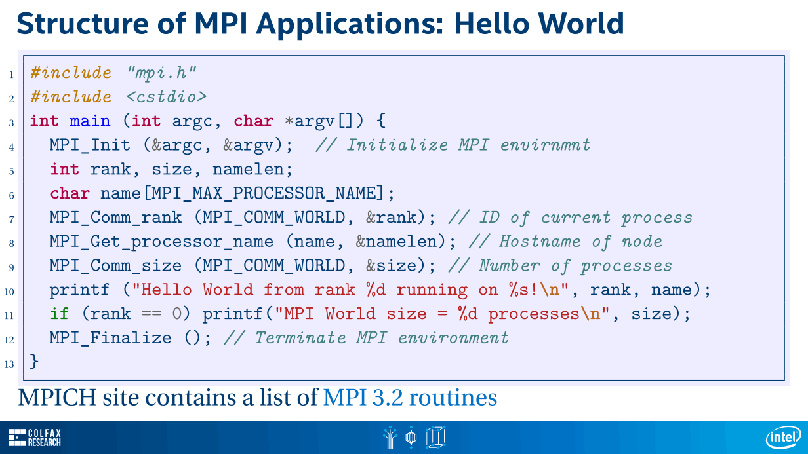

# 5.4 Compiling and Running with MPI
要运行使用MPI的应用程序，您必须遵循特殊的过程。首先，要编译MPI应用程序，我不能只使用常规编译器，我必须在编译器周围使用MPI包装器。例如，对于英特尔C++编译器，我必须使用mpiicpc。所有的编译器参数都是正常的，它产生一个可执行文件，它们必须以常规方式运行。在我们的集群上，要访问多个计算节点，您必须通过队列，因此，您创建一个命令文件，就像单个节点计算一样。最初，我们只需要一个计算节点。要启动我们的应用程序，这是可执行文件名称HelloMPI。我必须做的修改是我必须通过调用mpirun来添加可执行文件。mpirun是一个允许我作为多个主机上的MPI应用程序启动此可执行文件的脚本。在我想要运行的地方，我将在命令行参数中指定。在这个例子中，我告诉mpirun我想在localhost上启动这个应用程序的两个实例。因此，当我提交我的作业执行时，它将作为计算节点上的两个进程运行。输出是来自RANK1的Hello World，来自RANK0的Hello World，大小2进程。正如您所看到的，我有一个并行应用程序，因为我有两个Hello World，而我的程序只有一个打印行。这是因为我在同一台机器上运行了两个具有不同ID的进程。

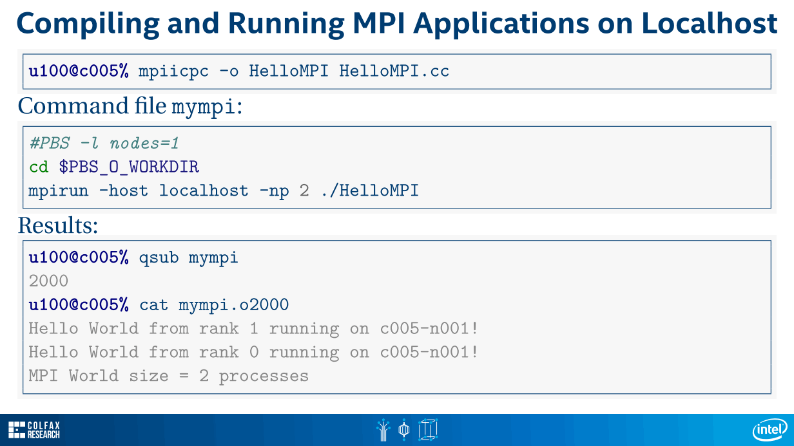

在多台主机上运行此应用程序怎么样？因为我们在集群环境中运行，所以我们将更改我们的作业文件，以便我们请求两个计算节点。然后我们将更改mpirun命令以使用参数machinefile。machinefile是MPI应用程序必须运行的节点列表，在我们的集群环境中，它实际上存储在环境变量PBS_NODEFILE中。那么让我们看看会发生什么。此作业启动时，将为其保留两个计算节点，但作业命令文件将在一个节点上启动。如您所见，此节点打印节点文件的内容，在我们的示例中，作业控制了c005-n001和c005-n002，即两个计算节点。当执行mpirun并将此节点文件传递给它时，mpirun将使用SSH登录到每个这些计算节点，启动此可执行文件。然后，当我们在可执行文件中运行MPI时，多个进程将相互找到。所以，我有一个并行应用程序。我有两个Hello World语句。但是一个来自计算节点一，另一个来自计算节点二。它涉及两个进程。该过程自然可以扩展到多个计算节点，我们只需要更改我们请求的节点数。当然，机器文件会更长，我们将从多台机器获得Hello World。

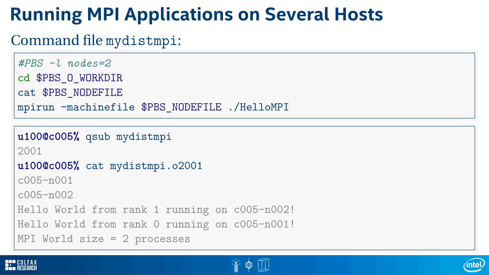

# 5.5 Peer-to-Peer Messaging
既然我们知道如何设计，编译和运行使用MPI的应用程序，那么我们来谈谈发送和接收消息。MPI中最简单的通信形式是peer-to-peer或point-to-point消息传递。在此模式下，两个进程参与通信。一个是发送者，它发送消息，另一个是接收者，它接收消息。所有其他进程不必等待此通信完成。通常，MPI应用程序的设计方式使您可以在多台计算机上运行一个代码。因此，您通常必须使用if语句进行点对点通信。在这个if语句中，您将检查，如果我的RANK是发件人的RANK，那么我将发送。否则，如果我的RANK是接收者的RANK，我将收到一条消息。每个Recv命令必须具有匹配的Send命令。否则，应用程序将挂起。MPI中的消息是数组，它们可以是预定义类型的数组。在这种情况下，这是一个字符数组，或者它们可以是用户定义类型的数组。Send命令具有基本语法，您可以在其中指示指向包含消息的缓冲区的指针。您可以指示消息的长度以及该消息中元素的数据类型。字符，整数，浮点数，单精度或级别精度或用户定义的类型。您还必须指明将Message发送给谁。这里的接收器是一个常数零，一到三，这是接收进程的RANK。您也可以选择指定TAG，这对于定义自己的通信协议很有用。TAG将是该缓冲区中包含的消息的类型。消息传递是在Communicators中定义的。在其中定义了RANK和通信例程的进程组。在这种情况下，我使用了MPI_COMM_WORLD。默认Communicator，包括我的应用程序中使用的所有进程。如果我是接收器，我必须创建一个缓冲区来保存此消息并调用函数MPI_Recv。此函数必须知道消息的放置位置，期望的元素数量，类型，发送消息的人员或接收消息的人员。这也可以是一个特殊的常量，允许我从任何人接收消息，如果我有来自同一个接收器的不同标签的多条消息，那么消息TAG，我只会匹配我在此处指定的TAG，以及Communicator。此外，MPI_Recv返回通信状态。Stat是特殊类型MPI状态的常量。MPI中有许多种发送和接收操作。您可以使它们同步或异步，阻止或非阻塞。你可以让它们进行通信。您可以将用户空间缓冲区附加到它们。我稍后会告诉你在哪里可以了解更多信息。但是如果你不知道更好，如果你没有任何理由做自己的通信，比如说，非阻塞，那么MPI_Send和MPI_Recv应该是点对点通信的默认选择。

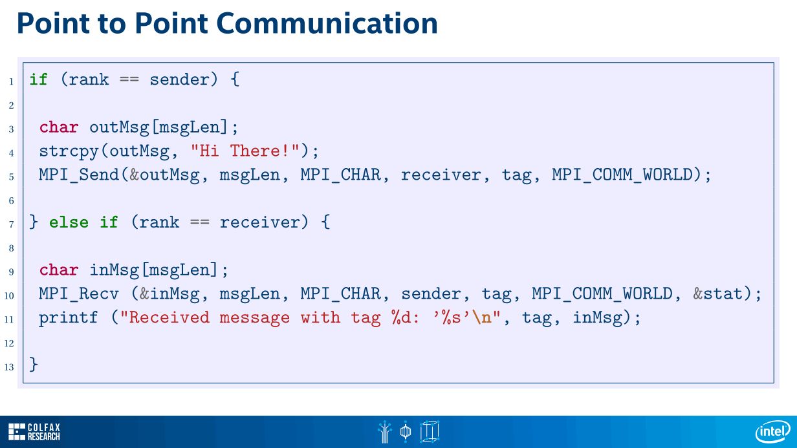

# 5.6 Collective Communication
除了点对点消息传递之外，MPI还支持`Collective Communication`。MPI是为计算应用程序而构建的。在计算应用中有一些常见的模式比如，所有令人尴尬的并行计算完全没有通信或者是one to all的模式或者是all to one的模式有多个接收者或发送者。还有一些模式，您可以将模拟域分割为多个部分，并将不同的部分分配给不同的处理器，您希望与邻居交换边界单元。MPI为许多这样的模式构建了`Collective Communication`例程。例如，有广播例程和one to all通信模式。假设您有一个处理器，其中有一个数据集，并且您希望跨多个接收器复制这个数据集。

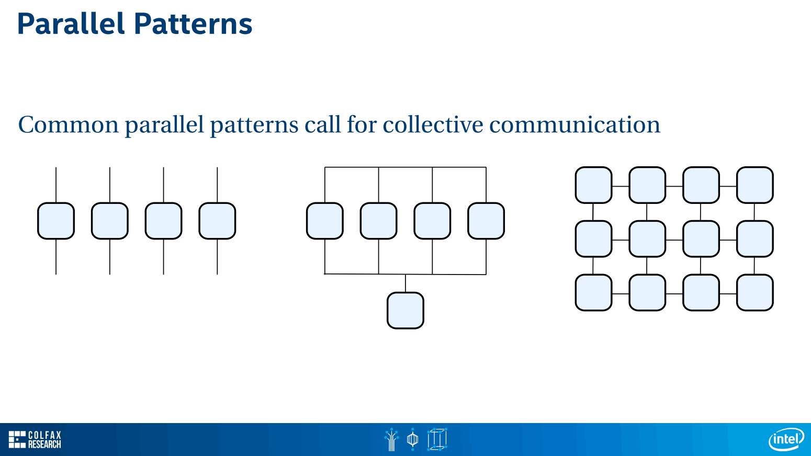

为此，MPI支持MPI广播例程，它接受指向消息的指针、消息长度和数据类型、root是发送方进程的RANK，和定义此模式的通信器。当然，您可以使用循环来实现此模式。在这个循环中，您将在一端执行MPI发送，另一端执行MPI接收。但是使用`Collective Communication`例程有两个优点。第一个是算法。如果你使用循环，则是串行通信。如果你有n个接收器，代价是o (n)一个好的MPI实现可能会使用一个更复杂的算法来降低复杂度，例如，o (log n)它可以做到，例如，使用这个树模式。发送者不是向所有人发送消息，而是向几个接收者发送消息。然后这些接收器开始向它们的邻居发送信息。正如您所看到的，这是一个并行的通信模式，您不需要做任何事情来并行化它。你只需要依靠通信例程。第二个原因是构造的功能性。专门的织物，如在Infiniband或在Omni-Path可能已经为集体沟通内置了功能。例如，如果您有一个对所有模式，那么fabric可能能够从交换机上的一个端口提取消息，并在交换机上的多个端口上复制此消息，从而减少移动的数据总量。一个好的MPI实现，结合良好的fabric驱动程序，将内置此功能，您不需要知道它是如何在硬件中实现的。您所要做的就是依赖于诸如广播之类的`Collective Communication`原语。

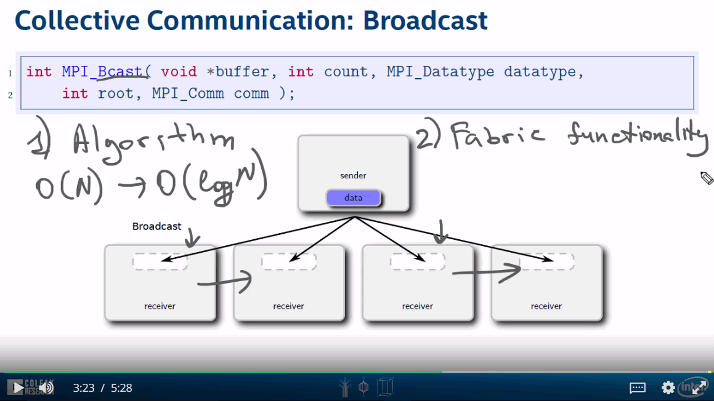


但也有其他`Collective Communication`的例子，比如Scatter。Scatter模式在单个进程中接受一个大数据集，将其分割，并将不同的数据集发送给不同的接收方。

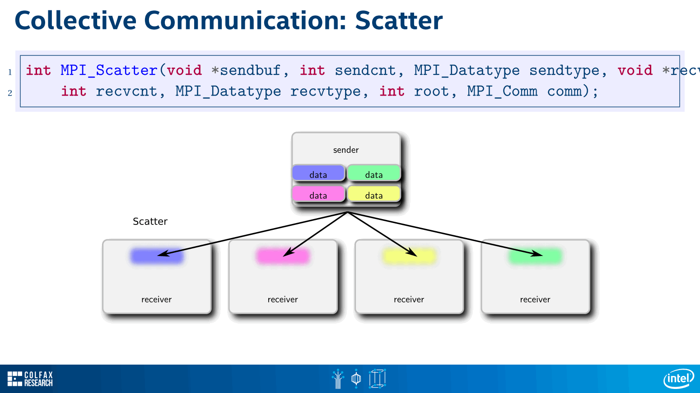


还有一个相反的操作，您有多个发送器，其中包含较大数据集的一部分，MPI Gather将把这些部分聚合到接收器上的较大数据集中。也有MPI all Scatter and Gather。它们将额外执行一个步骤，并将聚合的数据集传播到所有发送方。

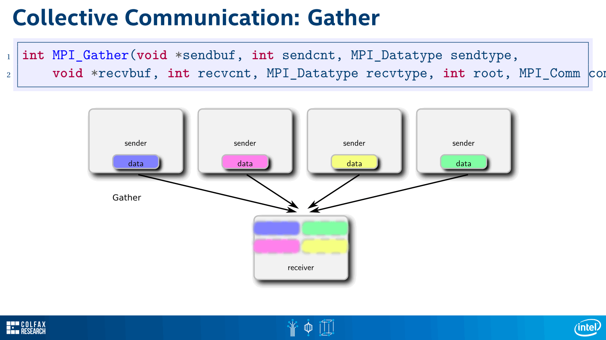

还有reduction通信例程，在这个例程中，您可以在单个处理器上聚合来自多个节点的多个数据集。当你做聚合时，你应用一个运算符，一个reduction运算符，比如最小值，最大值，和积等等。还有MPI all reduce，它将在那之后采取一个步骤，并将最终结果传播到所有发送方。对于所有的`Collective Communication`例程，您只需从代码中调用这个例程，以便所有处理器都能执行它，而不会有if语句。记住，对于MPI send和MPI receive，必须区分发送方和接收方。为此，我们使用if语句。这对于`Collective Communication`是不需要的，因为您将指定发送者，或者将您的rank作为例程的参数之一。


## Demo
- Change
```diff
[u25693@c008 stencil]$ git diff
diff --git a/Makefile b/Makefile
index b97390f..8bb995f 100644
--- a/Makefile
+++ b/Makefile
@@ -1,4 +1,4 @@
-CXX=icpc
+CXX=mpiicpc
 CXXFLAGS=-c -qopenmp -qopt-report=5 -xMIC-AVX512
 LDFLAGS=-qopenmp -lpng -lmemkind

@@ -13,7 +13,7 @@ run:  all
        ./stencil test-image.png

 queue: all
-       echo 'cd $$PBS_O_WORKDIR ; ./stencil test-image.png' | qsub -l nodes=1:flat -N edgedetection
+       echo 'cd $$PBS_O_WORKDIR ; mpirun -machinefile $$PBS_NODEFILE ./stencil test-image.png' | qsub -l nodes=4:flat -N edgedetection

 clean:
        rm -f *.optrpt *.o stencil *output.png *~ edgedetection.*
diff --git a/image.cc b/image.cc
index 32dbc1c..6915a66 100644
--- a/image.cc
+++ b/image.cc
@@ -89,9 +89,12 @@ ImageClass<P>::~ImageClass() {


 template<typename P>
-void ImageClass<P>::WriteToFile(char const * file_name) {
+void ImageClass<P>::WriteToFile(char * file_name, int const myRank, int const nRanks) {

   // Open file
+  char base[100];
+  strcpy(base, file_name);
+  sprintf(file_name, "%d-%s", myRank, base);
   FILE *fp = fopen(file_name, "wb");
   if (!fp) {
     printf("Could not open %s for writing\n", file_name);
diff --git a/image.h b/image.h
index a848c1a..f64bc23 100644
--- a/image.h
+++ b/image.h
@@ -16,7 +16,7 @@ class ImageClass {
   ImageClass(char const * file_name);
   ~ImageClass();

-  void WriteToFile(char const * file_name);
+  void WriteToFile(char * file_name, int const myRank, int const nRanks);
 };

 #endif
diff --git a/main.cc b/main.cc
index 41b867d..edfed28 100644
--- a/main.cc
+++ b/main.cc
@@ -1,4 +1,5 @@
 #include <cmath>
+#include <mpi.h>
 #include <omp.h>
 #include "image.h"
 #include "stencil.h"
@@ -15,6 +16,11 @@ double Stats(double & x, double & dx) {

 int main(int argc, char** argv) {

+  MPI_Init(&argc, &argv);
+  int myRank, nRanks;
+  MPI_Comm_rank(MPI_COMM_WORLD, &myRank);
+  MPI_Comm_size(MPI_COMM_WORLD, &nRanks);
+
   if(argc < 2) {
     printf("Usage: %s {file}\n", argv[0]);
     exit(1);
@@ -22,16 +28,21 @@ int main(int argc, char** argv) {

   ImageClass<P> img_in (argv[1]);
   ImageClass<P> img_out(img_in.width, img_in.height);
-
-  printf("\n\033[1mEdge detection with a 3x3 stencil\033[0m\n");
-  printf("\nImage size: %d x %d\n\n", img_in.width, img_in.height);
-  printf("\033[1m%5s %15s %15s %15s\033[0m\n", "Step", "Time, ms", "GB/s", "GFLOP/s"); fflush(stdout);
+
+  if (myRank == 0) {
+    printf("\n\033[1mEdge detection with a 3x3 stencil\033[0m\n");
+    printf("\nImage size: %d x %d\n\n", img_in.width, img_in.height);
+    printf("\033[1m%5s %15s %15s %15s\033[0m\n", "Step", "Time, ms", "GB/s", "GFLOP/s"); fflush(stdout);
+  }

   double t, dt, g, dg, f, df;

   for (int iTrial = 1; iTrial <= nTrials; iTrial++) {
+
+    MPI_Barrier(MPI_COMM_WORLD);
     const double t0 = omp_get_wtime();
-    ApplyStencil(img_in, img_out);
+    ApplyStencil(img_in, img_out, myRank, nRanks);
+    MPI_Barrier(MPI_COMM_WORLD);
     const double t1 = omp_get_wtime();

     const double ts   = t1-t0; // time in seconds
@@ -49,21 +60,29 @@ int main(int argc, char** argv) {
     }

     // Output performance
-    printf("%5d %15.3f %15.3f %15.3f %s\n",
-          iTrial, tms, gbps, fpps, (iTrial<=skipTrials?"*":""));
-    fflush(stdout);
+    if (myRank == 0) {
+      printf("%5d %15.3f %15.3f %15.3f %s\n",
+            iTrial, tms, gbps, fpps, (iTrial<=skipTrials?"*":""));
+      fflush(stdout);
+    }
   }

-  Stats(t, dt);
-  Stats(g, dg);
-  Stats(f, df);
-  printf("-----------------------------------------------------\n");
-  printf("\033[1m%s\033[0m\n%8s   \033[42m%8.1f+-%.1f\033[0m   \033[42m%8.1f+-%.1f\033[0m   \033[42m%8.1f+-%.1f\033[0m\n",
+  if (myRank == 0) {
+    Stats(t, dt);
+    Stats(g, dg);
+    Stats(f, df);
+    printf("-----------------------------------------------------\n");
+    printf("\033[1m%s\033[0m\n%8s   \033[42m%8.1f+-%.1f\033[0m   \033[42m%8.1f+-%.1f\033[0m   \033[42m%8.1f+-%.1f\033[0m\n",
         "Average performance:", "", t, dt, g, dg, f, df);
-  printf("-----------------------------------------------------\n");
-  printf("* - warm-up, not included in average\n\n");
+    printf("-----------------------------------------------------\n");
+    printf("* - warm-up, not included in average\n\n");
+  }
+
+  char file_name[100];
+  strcpy(file_name, "output.png");
+  img_out.WriteToFile(file_name, myRank, nRanks);
+  printf("\nOutput written into %s\n", file_name);

-  img_out.WriteToFile("output.png");
-  printf("\nOutput written into output.png\n");
+  MPI_Finalize();

 }
diff --git a/stencil.cc b/stencil.cc
index 6dfac2a..3e22de0 100644
--- a/stencil.cc
+++ b/stencil.cc
@@ -1,16 +1,20 @@
 #include "stencil.h"

 template<typename P>
-void ApplyStencil(ImageClass<P> & img_in, ImageClass<P> & img_out) {
-
+void ApplyStencil(ImageClass<P> & img_in, ImageClass<P> & img_out, int const myRank, int const nRanks) {
+
   const int width  = img_in.width;
   const int height = img_in.height;

+  const double rowsPerProcess = double(height-2)/double(nRanks);
+  const int myFirstRow = 1 + int(rowsPerProcess*myRank);
+  const int myLastRow  = 1 + int(rowsPerProcess*(myRank+1));
+
   P * in  = img_in.pixel;
   P * out = img_out.pixel;

 #pragma omp parallel for
-  for (int i = 1; i < height-1; i++)
+  for (int i = myFirstRow; i < myLastRow; i++)
 #pragma omp simd
 #pragma vector nontemporal
     for (int j = 1; j < width-1; j++) {
@@ -26,5 +30,5 @@ void ApplyStencil(ImageClass<P> & img_in, ImageClass<P> & img_out) {

 }

-template void ApplyStencil<float>(ImageClass<float> & img_in, ImageClass<float> & img_out);
-template void ApplyStencil<png_byte>(ImageClass<png_byte> & img_in, ImageClass<png_byte> & img_out);
+template void ApplyStencil<float>(ImageClass<float> & img_in, ImageClass<float> & img_out, int const myRank, int const nRanks);
+template void ApplyStencil<png_byte>(ImageClass<png_byte> & img_in, ImageClass<png_byte> & img_out, int const myRank, int const nRanks);
diff --git a/stencil.h b/stencil.h
index 3455471..2487f27 100644
--- a/stencil.h
+++ b/stencil.h
@@ -5,6 +5,6 @@
 #include <omp.h>

 template<typename P>
-void ApplyStencil(ImageClass<P> & img_in, ImageClass<P> & img_out);
+void ApplyStencil(ImageClass<P> & img_in, ImageClass<P> & img_out, int const myRank, int const nRanks);

 #endif

```
- output
```bash
[u25693@c008 stencil]$ cat edgedetection.o90007

########################################################################
# Colfax Cluster - https://colfaxresearch.com/
#      Date:           Sun Apr 28 07:38:16 PDT 2019
#    Job ID:           90007.c008
#      User:           u25693
# Resources:           neednodes=4:flat,nodes=4:flat,walltime=00:02:00
########################################################################


Edge detection with a 3x3 stencil

Image size: 6016 x 6000

 Step        Time, ms            GB/s         GFLOP/s
    1           1.724          41.875         376.871 *
    2           0.504         143.233        1289.100 *
    3           0.441         163.673        1473.058 *
    4           0.388         186.106        1674.958
    5           0.406         177.801        1600.209
    6           0.531         135.966        1223.690
    7           0.434         166.371        1497.339
    8           0.388         185.992        1673.929
    9           0.394         183.179        1648.613
   10           0.467         154.566        1391.096
-----------------------------------------------------
Average performance:
                0.4+-0.0      170.0+-17.6     1530.0+-158.1
-----------------------------------------------------
* - warm-up, not included in average


Output written into 1-output.png

Output written into 0-output.png

Output written into 3-output.png

Output written into 2-output.png

########################################################################
# Colfax Cluster
# End of output for job 90007.c008
# Date: Sun Apr 28 07:38:27 PDT 2019
########################################################################

```
# 4.7 Learn More
我们已经讨论了MPI的基本原理:如何设计应用程序，使运行在不同机器上的进程能够找到彼此;如何使用MPI库编译这样的应用程序，以及如何在集群上执行它。我们讨论了两种消息传递模式:点到点消息和集体通信。原则上，这已经足够让您使用分布式计算并对其进行大量操作。但如果你想了解更多，我们已经编制了一份……这张幻灯片上的链接是可点击的，你可以点击它们在MPI论坛上打开网页。如果您想了解更多关于MPI的信息，可以考虑研究通信模式，如阻塞和非阻塞、同步和异步以及就绪模式通信。它们可能允许您将通信与计算重叠，从而获得更有效的配置。您还可以阅读有关消息缓冲区的信息。单词buffer在MPI的不同上下文中有不同的含义。有应用程序、系统和用户空间缓冲区。它们可能允许您简化应用程序如何使用内存进行通信。例如，如果您有一个复杂的应用程序，不同的进程处理不同的任务，或者不同的进程运行在不同的平台上(如Xeon和Xeon Phi协处理器)，您可能需要研究通信器和组，以便在应用程序的一部分中定义集体通信例程。如果你想发送比标量更复杂的数据类型，支持开箱即用，阅读派生的数据类型，在集体通信中是非常强大的，如果你想充分利用它，你需要详细研究它。这就是联系。当你用MPI编程时，你通常会做混合编程，其中你的MPI处理器是多线程的。通常，这将自然地工作。只需在代码中启动一个openMP并行区域，如果每个节点运行多个RANK，MPI将负责正确的进程固定。但是如果您想了解更多，请阅读使用此链接的混合编程。最后，MPI的最新版本可能有关于单向通信的有趣信息。这是有效的远程内存访问，您可以使用最后一个链接了解它。有关更多信息，您可以阅读来自Lawrence Livermore国家实验室的MPI教程，他们也在Kofax的书中讨论了MPI。

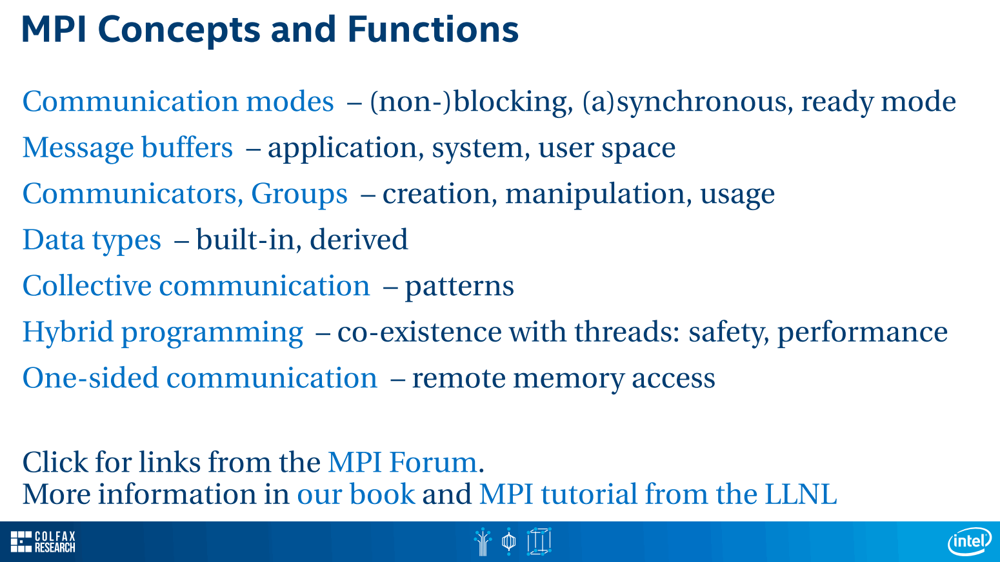

MPI消息传递接口是一种分布式内存编程框架。它允许您在集群中的多个处理器上运行应用程序。MPI的理念是，作为开发人员，您可以专注于实现通信算法，而不需要担心正在通信的体系结构的细节。MPI实现将处理这个问题。如果有公共的集体通信模式，可以使用MPI中的内置函数。它们可能使用改进的算法来并行化您的通信，并且它们可能依赖于特定类型的集体通信的fabric的功能。如果您使用Intel Xeon Phi协处理器，那么与之协同工作的一种架构就是Intel omnipath，它可以为短消息提供微秒延迟和100千兆比特每秒带宽。矢量化、多线程、集群计算和高效的内存访问。对于优化您的应用程序，有很多容易实现的目标。如果您想了解更多信息，请参加本系列的下一门课程，Intel架构的性能优化。

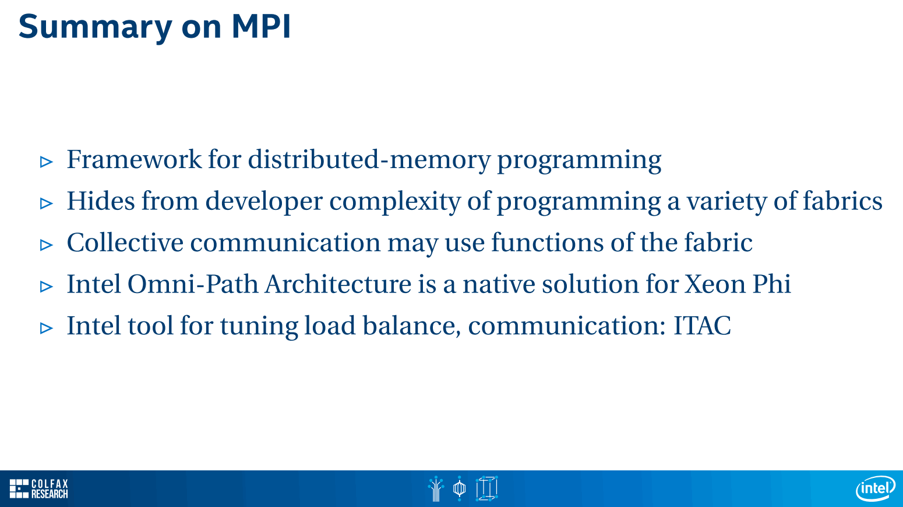
